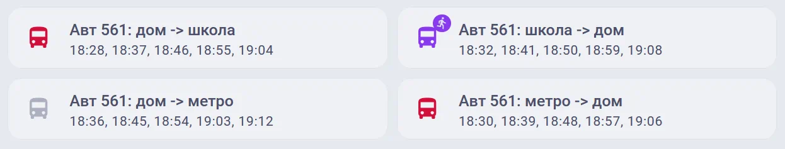

# Moscow Bus Tracker (via data.mos.ru)

Интеграция для отображения расписания выбранного автобуса (трамвая, …) на выбранной остановке в городе Москве.

Используется информация с [Портала открытых данных Правительства Москвы](https://data.mos.ru).

## Особенности

* Вам потребуется собственный API-ключ для получения данных ([получить его можно на Портале открытых данных](https://data.mos.ru/developers), это бесплатно, необходим лишь аккаунт mos.ru);
* Можно добавить несколько маршрутов, несколько остановок, в ту или обратную сторону;
* Используется карта (на Портале) для точного выбора стороны дороги, где расположена остановка (влияет на направление движения);
* С сервера скачивается целиком расписание на день, и уже из локальной копии раз в минуту обновляются данные для отображения, таким образом вы не топите сервер запросами, даже если добавляете несколько остановок и маршрутов;
* Отображается время не только одного ближайшего автобуса, но и нескольких последующих (на случай если вы не успеваете на ближайший);
* Ушедший автобус ещё пару минут отображается как "пропущенный", чтобы вы на него не бежали (или наоборот бежали, вдруг он тоже опоздает);
* Если до автобуса осталось мало времени, то цвет иконки меняется;
* Корректно отображаются автобусы после полуночи: они относятся ко "вчерашнему" расписанию (важно если расписание разное в разные дни, например будни/выходные);

## Установка через HACS

[](https://my.home-assistant.io/redirect/hacs_repository/?owner=justdmitry&repository=moscow_bus_tracker&category=integration)

1. Перейдите в **HACS** -> **Интеграции**
2. В правом верхнем углу нажмите три точки -> **Пользовательские репозитории** (Custom Repositories)
3. Вставьте ссылку на этот репозиторий GitHub
4. В поле "Категория" выберите **Интеграция**, и потом нажмите **Добавить**
5. Найдите `Moscow Bus Tracker` в поиске HACS и нажмите **Скачать**
6. Перезапустите Home Assistant

## Добавление информации о расписании

1. Перейдите в **Настройки** -> **Устройства и службы**
2. Нажмите **Добавить интеграцию** и найдите **Moscow Bus Tracker**
3. На первом шаге добавляется ваш API-ключ (там же есть ссылка для его получения)
4. Далее для одного ключа можно добавить несколько маршрутов (кнопка "Добавить Маршрут"): надо будет ввести точный **номер маршрута** (например `123`) и **часть названия остановки** (например `Ильинские` или `Библиотека имени`). Важно соблюдать регистр символов, так как Портал, увы, умеет искать данные только по точному совпадению (остановка `Метро Библиотека имени Ленина` найдется по словам `Библиотека` или `имени Ленина`, но не найдется по `библиотека` или `Библиотека Имени`). После проверки будет отображен список найденного - обычно один маршрут, и несколько остановок (остановки с разных сторон дороги, даже с одинаковым названием, - это разные остановки, и через них транспорт ходит в разные стороны и по разному расписанию), так что используя ссылки на карту выберите ту остановку, которая находится на нужной вам стороне дороги.

## Вывод информации

Значением сенсора является время ближайшего автобуса. В дополнительных атрибутах хранятся времена нескольких последующих автобусов, а также данные для лучшего визуального представления.

Текст для карточки [Mushroom Cards](https://github.com/piitaya/lovelace-mushroom):
```yaml
type: custom:mushroom-template-card
entity: sensor.route_1_stop_2 # <<<<<< не забудьте выбрать тут ваш сенсор
primary: '{{ entity_name(entity) }}'
secondary: '{{ states(entity) }}, {{ state_attr(entity, "upcoming") | join(", ") }}'
icon: '{{ state_attr(entity, "icon") }}'
color: '{{ state_attr(entity, "icon_color") }}'
badge_icon: '{{ state_attr(entity, "icon_badge") }}'
badge_color: '{{ state_attr(entity, "icon_color") }}'
```

Пример (красный автобус недавно ушел, фиолетовый вот-вот придёт, до серого ещё далеко):
